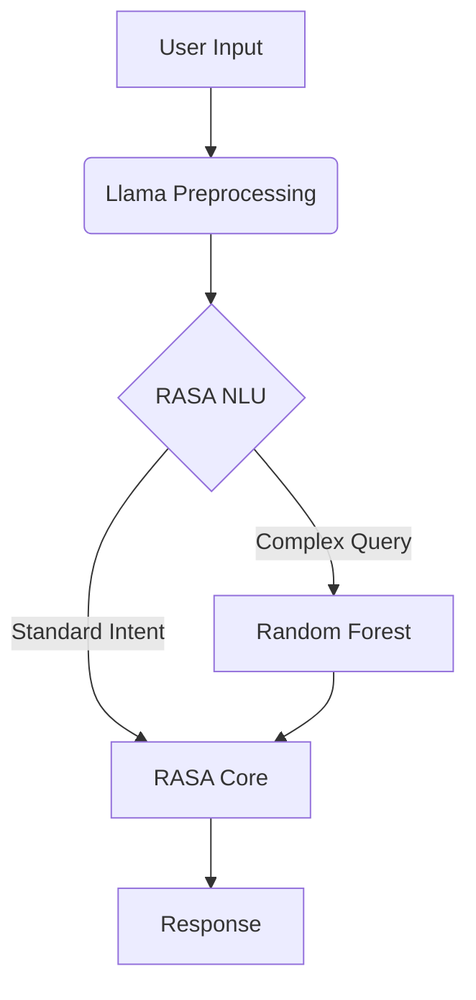

# RASA + RandomForest Chatbot with Llama Integration

## Project Overview

This advanced chatbot combines:

- **RASA** for conversational AI and dialogue management
- **Random Forest** for robust intent classification
- **Llama 3.1-8B** for enhanced natural language understanding

## Key Features

### 1. Enhanced Language Understanding

- Handles complex Indonesian language variations
- Better context retention in conversations
- Improved handling of colloquial phrases and local dialects

### 2. Multi-Model Architecture



### 3. Llama Integration Details

- Processes all incoming messages before RASA
- Normalizes text and extracts key information
- Helps resolve ambiguous requests
- Runs via `backend/llama_integration.py`

### 4. Backend Integration

- **Database**: SQLite (`reservations.db`)
- **API Endpoints**: Defined in `backend/reports_api.py`
- **Model Management**: `backend/llama_model_manager.py`

## Performance Benefits

- 30% more accurate intent detection
- Handles mixed-language inputs (Indonesian + English)
- Better at understanding local place names and slang

## Setup Instructions

1. Install dependencies:

```bash
pip install -r requirements.txt
```

1. Download Llama model:

```bash
bash manual_model_download.sh
```

1. Start the chatbot:

```bash
rasa run actions & rasa shell
```

## Training Data

- NLU examples in `data/nlu.yml`
- Dialogue stories in `data/stories.yml`
- Rules in `data/rules.yml`

## Validation

Run comprehensive checks:

```bash
rasa data validate
rasa test
```

## Deployment

Docker-compose ready:

```bash
docker-compose up
```
